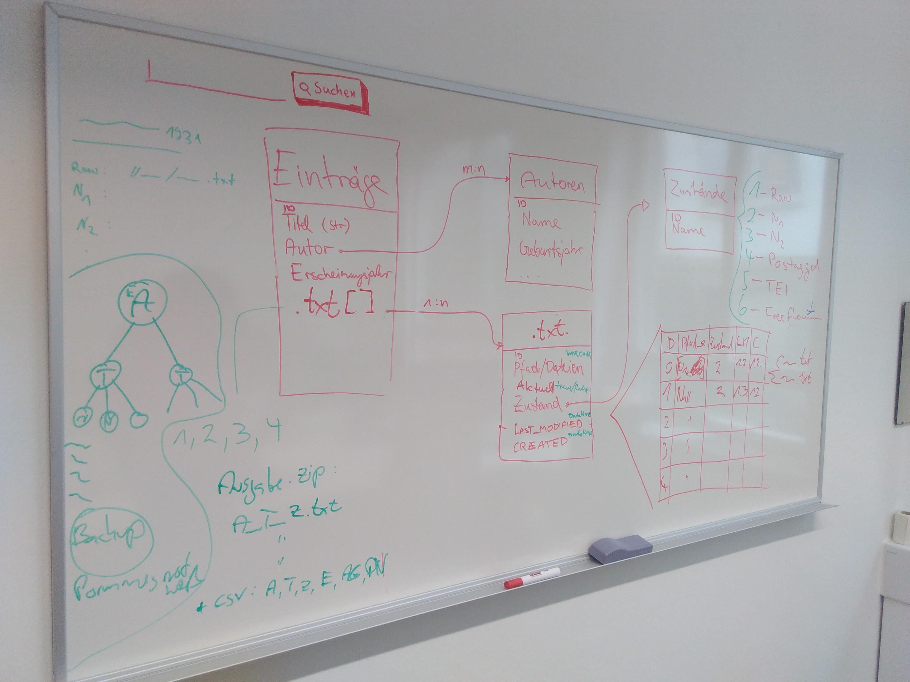
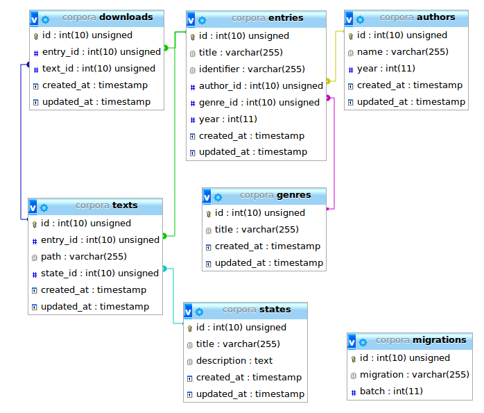

% DB Corpora -- Digital Humanities Uni S
% Claus-Michael Schlesinger | Michael Werner Czechowski
% 6.2.2017 (v1.99)

## Kurzbeschreibung

- Corpusdaten für die computergestützte Textanalyse
- Trennung von plain text und Metadaten
- Abbildung von verschiedenen Zuständen des gleichen Texts
- analyseorientiert
- präzise Vorgaben

Die Datenbank dient der Speicherung von Corpusdaten. Das Grundelement des Gesamtcorpus ist ein Einzeltext. Jeder Text kann erstens eine Reihe von Zuständen haben und ist zweitens durch eine Reihe von Metadaten markiert. Über die Suchfunktion einer Webanwendung können Subcorpora aus dem Gesamtcorpus zusammengestellt werden. Datenbank und Webanwendung dienen ausschließlich der Vorhaltung und Bereitstellung von Texten, es werden keinerlei Analysefunktionen und keine Schnittstellen für bereichsexterne Anwendungen bereitgestellt. Die Datenbank liegt direkt auf dem Compute-Server oder ist von dort aus erreichbar. Daten lassen sich sowohl über die Webanwendung als auch direkt aus der Datenbank auslesen (SQL-Abfragen nur für User, die auf dem Server eingelogged sind), sodass SQL-Abfragen in eigene Analyseskripte, die auf dem Computeserver ausgeführt werden, integriert werden können.

# Usecase: Speichern und Bereitstellen

- Datenhaltung
- Datenoptimierung

## Speichern

#. primäre Datenbank
	- Verwaltung von eigenen Corpora
	- eigene Daten werden nicht selbst gespeichert

#. sekundäre Datenbank
	- Austausch (Repository)
	- eigene Daten werden redundant gespeichert

--> DB Corpora für beides nutzbar, **aber:** Neuentwicklung! Stabilität und Integrität der Daten kann *nicht* garantiert werden!

# Datenmodell

## Textzustände

Textzustand      | Beschreibung
---------------- | -------------------------------------------------------------
raw              | ausgangszustand (vor jeder bearbeitung)
normalisiert     | ohne Zusatztexte (z.B. Projekt Gutenberg Paratexte)
normalisiert 2   | Normalisierungen auf Zeichenebene (ins Kommentarfeld: welche Bearbeitungsschritte, genaue Zustandsbeschreibung des Texts)
pos-tagged       | (ins Kommentarfeld: Tool + Version + Datum der Bearbeitung)
annotiert        | TEI
freestyle        | beliebiger Zustand

Datenfeld zum Text (alle Zustände): Dokumentation der Bearbeitungsschritte (Freitext)

## Metadaten

- Text/Eintrag
	+ Titel (mandatory)
	+ AutorIn (mandatory, mehrere sind möglich)
	+ Erscheinungsjahr (mandatory, drei Möglichkeiten: Jahreszahl, nicht bekannt, ohne Jahr)
	+ Gattung (Lyrik, Epik, Drama, Märchen) <!-- optional,  -->
	+ deprecated (nur bei obsoleten Einträgen)
	+ Quelle (URL, eigener scan, bibliothekssignatur)
	+ Autorname wie er im Dokument erscheint <!-- optional -->
	+ version-ID (freies Textfeld)

- Autor
	+ Name (mandatory)
	+ Geburtsjahr <!-- optional -->
	+ Geschlecht <!-- optional -->
	+ GND-Nummer (Gemeinsame Normdatei) <!-- optional bzw. nicht obligatorisch, weil manche autoren ohne gnd-nummern; entspricht viaf/via (hentschel-vortrag) -->
	+ Institution (Autor=Institution: boolean)

Notwendige Angaben sind *Name, Titel, Erscheinungsjahr*, alle anderen Angaben sind optional.

 
## Definitionen

Eintrag
:    Ein Eintrag entspricht einem und nur einem erfassten Text/Titel mit den verschiedenen Textzuständen.

Textzustand
:    Ein Text, der zu einem Eintrag gehört, hat immer einen der definierten Zustände raw, normalisiert, normalisiert 2, pos-tagged, annotiert, freestyle (Definition der Textzustände s.o.)

Paratext
:    Zu den Paratexten, die in der Definition des Zustands *normalisiert* genannt sind, zählen sämtliche Texte oder Textteile, die *nicht* keine Entsprechung in der Vorlage haben, z.B. Annotationen oder, konkreter, die Hinzufügungen des Projekts Gutenberg, die sich in den dort bereitgestellten Texten finden.

## Datenhaltungsstrategie

Die Daten werden inkrementell ergänzt, d.h. Textdateien werden nicht von der Festplatte gelöscht. In der Datenbank sind die aktuellen Textdateien entsprechend markiert und werden bei einer Suche über die Webanwendung nach Einträgen und Textzuständen entsprechend angezeigt.
Löschungen können nur mit Administratorrechten im direkten Zugriff auf das Textverzeichnis und auf die Datenbank vorgenommen werden.

## Anforderungen Anwendung

*nth = nice to have*

- initialer Upload
	- Texte (in allen Zuständen) als plaintext-Datei (.txt)
	- Metadaten
		- über Formularfelder
		- aus Literaturdatenbank bzw. aus formatierten Daten (bibtex/biblatex) *nth*
- Bearbeitung
	- Alle Felder und Uploads müssen in einer separaten Maske bearbeitbar sein (Klärung der Rechteverteilung steht noch aus; darf jeder Nutzer Änderungen einbringen?)
- Löschen
	- Falls ein Dokument fehlerhaft ist oder nicht mehr benötigt wird, so kann jeder Nutzer eine Lösch-Anfrage stellen. Diese wird vom Admin überprüft und ggf. durchgeführt
- Bulk-Upload *(nice-to-have)* (in Ausnahmefällen skriptbasiert möglich, d.h. mit direktem Zugriff auf Datenbank und Speicher, nur mit Administratorrechten)
- ergänzender Upload für bereits vorhandene Einträge (Zugang über frühe Weiche: Bearbeitungsmodus/Suchmodus), es können nur einzelne Texte bearbeitet werden
	- Eingabemaske für Einzeltext mit allen Feldern
	- Anzeige bereits vorhandener Daten (bei bereits vorhandenen Text(zuständen) nur Link zum Volltext (öffnet im neuen Fenster/Lightbox))
	- Wenn Datenfelder überschrieben werden --> Warnung vor dem Überschreiben mit Angabe der Felder, die überschrieben werden
- Gesamtübersicht
	- Alle bisher hochgeladenen Texte anzeigen lassen
	- Soriermöglichkeiten z.B. nach Datum des Uploads etc. *nth*
- Suchen
	- nur Metadaten
	- nur Volltexte *nth*
	- Metadaten und Volltexte *nth*
- Bildschirmausgabe: Ergebnisliste (Suchfeld bleibt sichtbar)
- Download:
	- gesamte Ergebnisliste (csv)
	- Auswahl aus Ergebnisliste (Clickboxen?)
	- Ausgebeformat: zip-Datei mit einzelnen Textfiles und Liste mit bibliografischen Angaben (csv)

Die Datenbank bietet neben der Webanwendung auch einen direkten low-level-Zugang (SQL-Abfragen, nur Lesen!) für NutzerInnen, die am Server angemeldet sind.

# User Stories

### Suche
ID    | Beschreibung
----- | ------------------------------------------------------------------------
US000 | Nutzerin möchte mit einem oder mehreren Stichworten eine Suche über alle Datenbankfelder ausführen
US001 | Nutzerin möchte eine verknüpfte Suche ausführen, also etwa mit Autor und Titel oder nur Jahreszahl und Textzustand
US002 | Nutzerin möchte alle Einträge aus einem bestimmten Zeitraum sehen / durchsuchen
US003 | Nutzerin möchte aus der Ergebnisliste einzelne Einträge für den *Download* (US5) auswählen

### Ansicht
ID    | Beschreibung
----- | ------------------------------------------------------------------------
US100 | Nutzerin möchte alle hinterlegten Uploads in einer Übersicht/Liste ansehen können (Browsing)
US101 | Nutzerin möchte einen Eintrag im Detail anschauen und sehen, welche Textzustände vorhanden sind
US102 | Nutzerin möchte in der Eintragsansicht einen Text in einem bestimmten Textzustad ansehen
US103 | Nutzerin möchte den gesamten Eintrag als zip-Datei herunterladen (Texte plus Metadaten in csv-Datei)
US104 | Nutzerin möchte zurück zur Übersicht navigieren

### Eingabe
ID    | Beschreibung
----- | ------------------------------------------------------------------------
US201 | Nutzerin möchte neuen Eintrag anlegen (= Text mit Metadaten hochladen)
US202 | Nutzerin möchte neuen Autor mit weiteren Informationen anlegen
US203 | Nutzerin möchte neue Gattung hinzufügen
US204 | Nutzerin möchte weiteren Textzustand zu bestehendem Eintrag hinzufügen

### Bearbeitung

Hinweis: *Bereits hochgeladene Texte können nicht nachträglich verändert werden. Ebenso können Autorennamen und Gattungsbezeichnungen nur angelegt, nicht geändert werden. Die Metadaten für einen einzelnen Eintrag können geändert bzw. neu ausgewählt werden. Änderungen von Autorennamen, Gattungsbezeichnungen und Einträgen sind nur mit Administratorrechten möglich. Hochgeladene Texte/Textzustände werden inkrementell gespeichert und können nur mit Administratorrechten gelöscht werden.*

ID    | Beschreibung
----- | ------------------------------------------------------------------------
US301 | Nutzerin möchte Metadaten eines bestehenden Corpuseintrags ändern
US302 | Nutzerin möchte Informationen zu bestehendem Autor ändern
US303 | Nutzerin möchte bestehende Gattung ändern
US304 | Nutzerin möchte eine neue Fassung eines Textzustands hochladen

### Löschen

*Entwicklung: Dieser Punkt kann auch über eine Bedienungsanleitung geregelt werden und muss nicht notwendig in der Anwendung vorkommen.*

Hinweis: *Bei allen Lösch-Anträgen muss die Nutzerin eine Kontaktadressen angeben, sodass sie informiert werden kann, wie weit der Zustand der Bearbeitung ist.*

ID    | Beschreibung
----- | ------------------------------------------------------------------------
US401 | Nutzerin möchte Lösch-Auftrag für kompletten Eintrag beantragen
US402 | Nutzerin möchte Lösch-Auftrag für bestimmten Autor beantragen
US403 | Nutzerin möchte Lösch-Auftrag für bestimmte Gattung beantragen

### Download

Hinweis: *Bei allen Downloads wird eine CSV-Datei mit sämtlichen Metadaten (auch: vorhandene Textzustände) für jeden heruntergeladenen Eintrag beigefügt.*

ID    | Beschreibung
----- | ------------------------------------------------------------------------
US501 | Nutzerin möchte sich alle Einträge in der Ergebnisliste *(Suche)* als zip-Datei herunterladen
US502 | Nuterzin möchte sich eine CSV-Datei mit den Metadaten der Einträge in der Ergebnisliste herunterladen
US503 | Nutzerin möchte die ausgewählten Einträge der Ergebnisliste als zip-Datei herunterladen
US503 | Nutzerin möchte jeweils nur einen bestimmten Textzustand aller Einträge in der Ergebnisliste herunterladen, wenn dieser Textzustand existiert
US504 | Nutzerin möchte jeweils nur einen bestimmten Textzustand der ausgewählten Einträge in der Ergebnisliste herunterladen, wenn dieser Textzustand existiert

# Tech-Stack

### Verwendete Software

- LAMP-Server
- Laravel

### Lizenzen

#### LAMP
GNU/Linux, ansonsten abhängig von softwareseitigen Lizenzbestimmungen

#### Laravel
MIT-Lizenz

#### DB Corpora (Produkt)
Die Anwendung wird mit einer GNU General Public License zur Verfügung gestellt
