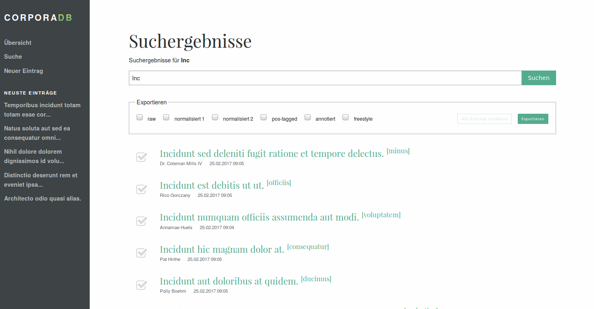

# CorporaDB

Database for collecting and refining corpus data. SQL database with web interface for users and API for direct SQL requests.



## Installation
~~~~~
1. git clone git@github.tik.uni-stuttgart.de:ac128227/db-corpora.git
2. composer install
3. php artisan migrate:install # initiate migrations
4. php artisan migrate # migrate predefined tables to database
5. php artisan storage:link # enable public file upload
5. php artisan serve
~~~~~

_`Composer` and `PHP` have to be installed previously._

## Configurations

~~~~~{bash}
cp .env.example .env # copy environment variables for productive usage
~~~~~

After copied `.env.example` to `.env` the environment variables are active. This file should not be versioned, because it contains database credentials etc. Inside the prefilled environment variables the database settings are configurated for a `Homestead` setup. You can also use an ordinary MySQL sever to hold your data.

## File Structure
As framework we are using Laravel 5.4 and serving from a self hosted server. For now this software is __heavily under construction__.

~~~~~
.env ----------------| stores database credentials etc.
app/ ----------------| main application files
  Http/ -------------| processing http requests
    Controllers/ ----| main controllers for application
    Provides/ -------| connecting routes with controllers
config/ -------------| general configurations
database/ -----------| database settings
  factories/ --------| generating automated seeds for database
  migrations/ -------| creating new database tables
  seeds/ ------------| automatically fill database
public/ -------------| distributed folder (DO NOT CHANGE MANUALLY)
resources/ ----------| resources necessary for the front end only
  lang/ -------------| translations for system wide notifications etc.
  views/ ------------| blade (template engine) files
    components/ -----| partial templates for extending inside layout files
routes/ -------------|
  web.php -----------| stores routes for browser requestes
~~~~~

## Optional: Enabling Git Hooks

To provide all markdown files also as human readable PDF files use the following `git-hook`:

```bash
  rm -rf .git/hooks && ln -s ../.hooks .git/hooks
```

## Authors

Michael Werner Czechowski (Planning, Programming):
<mail@dailysh.it>

Claus-Michael Schlesinger (Planning, Coordinator):
<claus-michael.schlesinger@ilw.uni-stuttgart.de>

## License
This software is distributed under GNU GPL.
